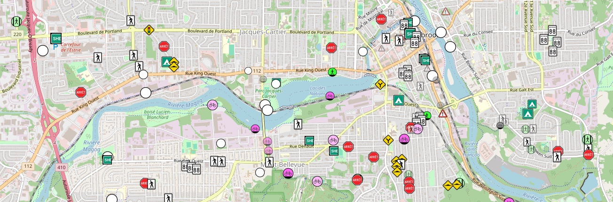

# OpenStreetMap: Liste TODO pour Sherbrooke

Liste d'ajouts/corrections potentiels, présents ou futurs, sur
[OpenStreetMap](https://www.openstreetmap.org/#map=13/45.3986/-71.9187)
pour le territoire de la ville de Sherbrooke.

- Consulter les données brutes: [`TODO.geojson`](TODO.geojson)

- Consulter la carte interactive:
https://fbriere.github.io/openstreetmap-todo-sherbrooke/

Les entrées de cette liste proviennent d'une multitude de sources (articles de journaux,
séances du conseil municipal, carte des travaux de la Ville, etc.) et reflètent une
variété de situations, allant d'un simple fait n'ayant qu'à être confirmé sur
place (`status=certain`) à un projet qui ne sera entrepris que dans le futur
(`status=planned`).

## Liste des attributs

### Description et catégorisation

- `name`: Courte description

- `type`: Catégorisation, parmi la liste ci-dessous:

  (Lors de l'édition via JOSM, la plupart des catégories sont identifiées sur la carte, via [`TODO.mapcss`](josm/TODO.mapcss), par un préfixe et/ou une couleur, indiqués ici entre chochets.)

  - `bicycle`: Infrascructure pour vélos autre que piste cyclable \[`◼`, magenta]
  - `crossing`: Traverse pour piétons \[`///`, vert]
  - `cycleway`: Piste cyclable \[magenta]
  - `demolition`: Démolition d'un immeuble \[`🕇`]
  - `footway`: Passage piétonnier \[vert]
  - `geometry`: Géométrie à ajuster \[orange]
  - `hump`: Dos d'âne \[`◠`]
  - `maxspeed`: Limite de vitesse \[`◼`, blanc]
  - `misc`: Autres
  - `name`: Concerne le nom de quelque chose \[`N:`]
  - `new`: Nouvelle rue \[aqua]
  - `oneway`: Sens unique à ajouter/retirer \[`⮕`]
  - `park`: Parc \[`▲`, vert]
  - `restriction`: Restriction à ajouter/retirer \[`✘`]
  - `sidewalk`: Trottoir \[`◼`, vert]
  - `sign`: Disparité entre le nom officiel et celui affiché sur place [`≠`]
  - `stop`: Arrêt \[rouge] \
      (Le texte est omis dans le cas typique d'un arrêt toutes directions à ajouter.)
  - `surface`: Surface d'une voie \[bleu pâle]
  - `traffic_signal`: Feu de circulation \[jaune]

### État/évolution

- `status`: État de l'avancement des travaux (ou confirmation dans le cas de `certain`)

  - `planned`: Travaux prévus
  - `ongoing`: Travaux en cours
  - `completed`: Travaux (théoriquement) complétés
  - `resolution`: Travaux qui ont fait l'objet d'une résolution à un conseil ou comité de la Ville
  - `official`: Travaux qui ont été inscrits à un règlement de la Ville
  - `certain`: Présence confirmée, mais auprès d'une source qui ne peut être citée; doit donc être vérifié sur place
  - `dubious`: Travaux sans aucun progrès visible depuis leur annonce initiale, possiblement annulés entre-temps

- `start_date`: Date prévue du début des travaux
- `planned_end`: Date prévue de la fin des travaux
- `check_date`: Date de la dernière vérification faite sur place

### Sources

- `source`: Source

- `session`: Date d'une séance d'un conseil ou comité de la Ville agissant comme source

- `resolution`: Résolution d'un conseil ou comité de la Ville agissant comme source

### Autres

- `comments`: Commentaires

Toutes les entrées ont également un attribut `TODO:marker` servant à les
identifier.

(Les attributs débutant par `osm:` et `ville:` sont à usage interne et peuvent être ignorés.)

## Contribuer

Liste des fichiers:

- [`TODO.geojson`](TODO.geojson): La liste elle-même
- [`TODO.mapcss`](josm/TODO.mapcss): [Modèle de rendu de carte JOSM](https://josm.openstreetmap.de/wiki/Fr%3AStyles) (*fortement recommandé*)
- [`TODO-preset.xml`](josm/TODO-preset.xml): [Préréglage](https://josm.openstreetmap.de/wiki/Fr%3APresets) facilitant l'édition ou visualisation d'une entrée de la liste

Pour soumettre une modification, assurez-vous d'installer préalablement
[jq](https://jqlang.org/) et d'activer le tri du fichier JSON avec la commande
suivante :

    git config filter.geojson.clean \
        "jq --indent 4 --sort-keys '.features |= sort_by(.geometry.coordinates)'"

## Auteur

Frédéric Brière - fbriere@fbriere.net
